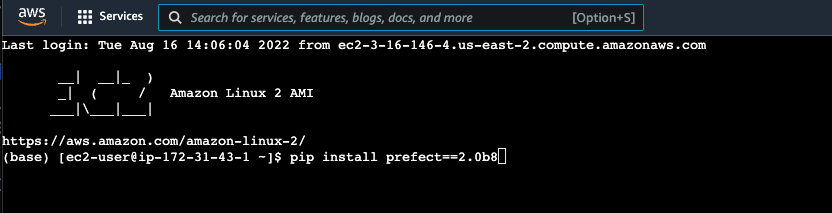

# Set up Prefect on AWS EC2

This is instruction of how you can set up free cloud VM on AWS (EC2).
Then guide on how to host [```Prefect```](https://www.prefect.io/) as a MLOps online server.

## Set up EC2 on AWS
1. **Creat AWS Account**

You need to have [AWS account](https://aws.amazon.com/free) which we will mainly use all provided free tier product in AWS Cloud.

2. **Create new EC2 instance**

I will go step-by-step on how you can create EC2 instance on AWS.<br/>
When open AWS service console search on seach box with EC2 and select the first item on the list


Then click on the "Instance" on left tab


You should see "Launch Instance" orange button on the upper right. Click to launc new EC2 service.


Now you can type your EC2 name. Mine is "mlops-experiments-server"


Then select image of your EC2. For free-tier product, I will should
```Amazon Linux 2 Kernel 5.10 AMI 2.0.20220719.0 x86_64 HVM gp2```


Select free-tier instance type which is ```t2.micro```


Create new Key-pair, after you click create you will get .pem file that can use to communicate with EC2 from your local computer. Just push your favourite name for it.


Remaining setting you can leave it as default value, then scroll down into the bottom. Click "Launch Instance"


3. **Setting Security Group on EC2**

After finish create new EC2 instance, you can go back to ```Instance``` menu and wait for a bit. You should see EC2 instance with naming you just create (Mine is "ml-pipeline-server"). Click on ```Instance ID```


Then click on ```Security``` menu after select ```Instance ID```


Click on ```Security groups``` link to edit inbound rules for our EC2


On security groups page, click on edit ```Edit inbound rules```


Then add new inbound rules as below pictures.
- HTTP 
- SSH
- Custom TCP : Port range = 4200
- Custom UDP : Port range = 4200 <br/>
Then click ```Save rules``` !


3. **Connect to EC2 and set up Prefect**
Go back you EC2 instance you have create, you can click ```Connect``` to connect directly with your EC2 with EC2 instance connect mode!


Now I would advise you to install ```conda``` to create environment for prefect by following this [link](https://www.eternalsoftsolutions.com/blog/how-to-install-anaconda-on-aws-linux-instance/)

After that you should install ```prefect``` into your conda environment. I use 2.0b8 version in this tutorials
``` bash
pip install prefect==2.0b8
```



You check installation completeness by use below script
``` bash
prefect version
```
You expect to see somethings like below snapshot.


Then you have to set ```PREFECT_ORION_UI_API_URL``` with below script. You have to replace *```<external-ip>```* with you *Public IPv4 Address* from your EC2 instance

``` bash
prefect config set PREFECT_ORION_UI_API_URL="http://<external-ip>:4200/api"
```

You can get your *Public IPv4 Address* from this position.


Final is start Orion server with

``` bash
prefect orion start --host 0.0.0.0
```

Then you can access to your Prefect server with this kind of link.
- ```<Public IPv4 DNS>```:4200
- ```<Public IPv4 Address>```:4200

Both Public IPv4 DNS and Address can get from your EC2 instance.

4. **Set local Prefect to connect with remote Prefect**

You have to run below script to config your local prefect to point running result to remote localtion.
``` bash
prefect config set PREFECT_API_URL="http://<external-ip>:4200/api"
```

That it all folk! Thank for following along with me. :) 

